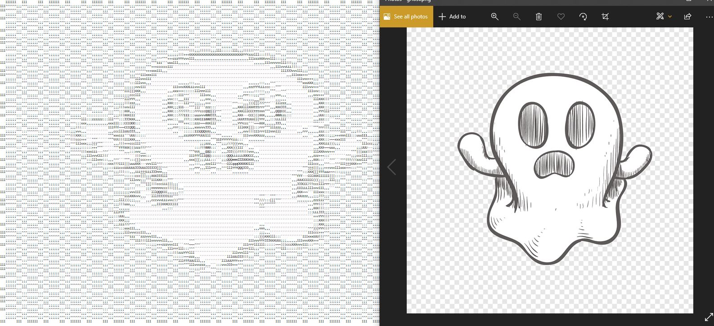

# ASCII Art - by Will Lindstrom
 - Created with inspiration and guidance from Robert Heaton's Programming Projects for Advanced Beginners (PPAB) blog:
 	https://robertheaton.com/2018/06/12/programming-projects-for-advanced-beginners-ascii-art/
 
 - The idea is to take an image (resized and rotated as need be), read through its pixels, and then convert each pixel into a single brightness value using the RGB values (tuple) for each pixel. These brightness values are then plugged into a formula that assigns them to one character from a predetermined string of ASCII characters based on how bright/dark they are, and the output will be an image where each pixel (assuming no image resizing) is converted to an ASCII character. 
 
 - Smaller, less-detailed images with a solid color background seem to turn out the best once transformed. That being said, I have had some success with larger detailed pictures, but the lighting in those types of pictures determines how clear the image will show. 
 
 ### Future plans:
 
 	- Expand functionality and turn it into an executable.
 	
 	- Add a progress bar
 	
 	- I want to eventually check for orientation metadata in images so as to remove guess-work
 	
 	- I would like to print the characters in their colors based on pixel color data
 	
 	- Add a way to preview the final zoomed-out image within the UI (without having to open the .txt) 
 	 
 	 
##Here are some example image comparisons, with the ASCII output on the left:
 
 
###Resized to 80x80:

 
 
###Resized to 320x320:

 
 
 
 
 
 
 
 