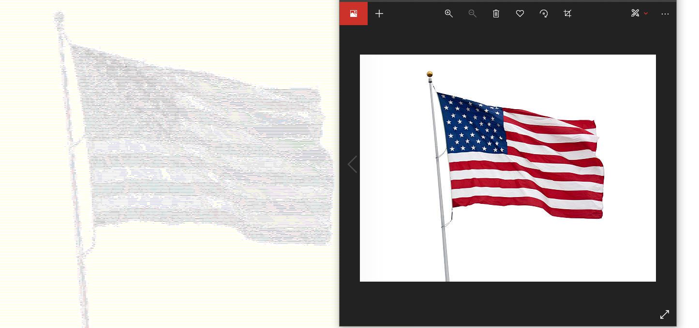
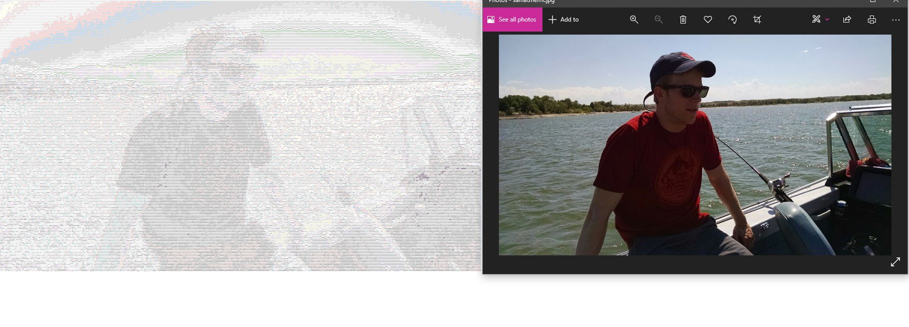
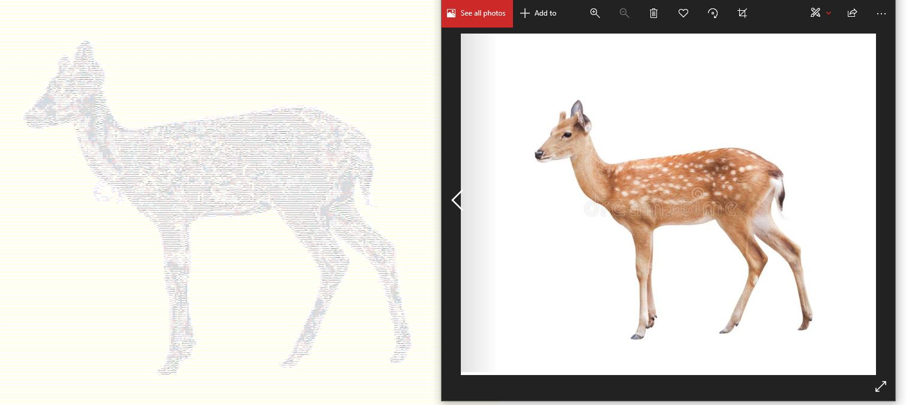
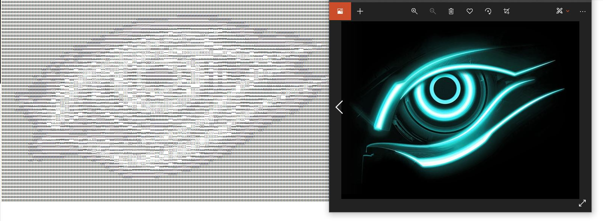

# ASCII Art - by Will Lindstrom
 - Created with inspiration and guidance from Robert Heaton's Programming Projects for Advanced Beginners (PPAB) blog:
 	https://robertheaton.com/2018/06/12/programming-projects-for-advanced-beginners-ascii-art/
 
 - The idea is to take an image (resized and rotated as need be), read through its pixels, and then algorithmically convert the pixels into a single brightness value using the RGB tuple values for each pixel. These brightness values are then compared to a predetermined string of ASCII characters and assigned to a character based on how bright/dark they are, and the output will be an image where each pixel (assuming no image resizing) is converted to an ASCII character. 
 
 - Note: in the current version (5/11) the output is displayed in the IDE console, in which the width must be resized manually or the image won't print correctly. Since it's tough to zoom out and resize the console window to see the whole image, I usually just copy/paste the output to a .txt file and ctrl- to zoom out. I have messed with writing output to a .txt directly but ran into some issues with spacing.
 - smaller, less-detailed images with a solid color background seem to turn out the best once transformed. That being said, I have had some success with larger detailed pictures, but the lighting in those types of pictures determines how clear the image will show. 
 
 ### Future plans:
 	- I would like to add a GUI for this application, and maybe turn it into an executable or web app.
 	- Needs further testing, but I would like to resize images in such a way that you can see the ASCII characters clearly without needing to zoom in. This would work best with a small/clear picture to start with, so as not to lose clarity in the final image.
 	
 	 
 - Here are some example image comparisons, with the ASCII output on the left:
 
 
 
 
 
 
 
 
 